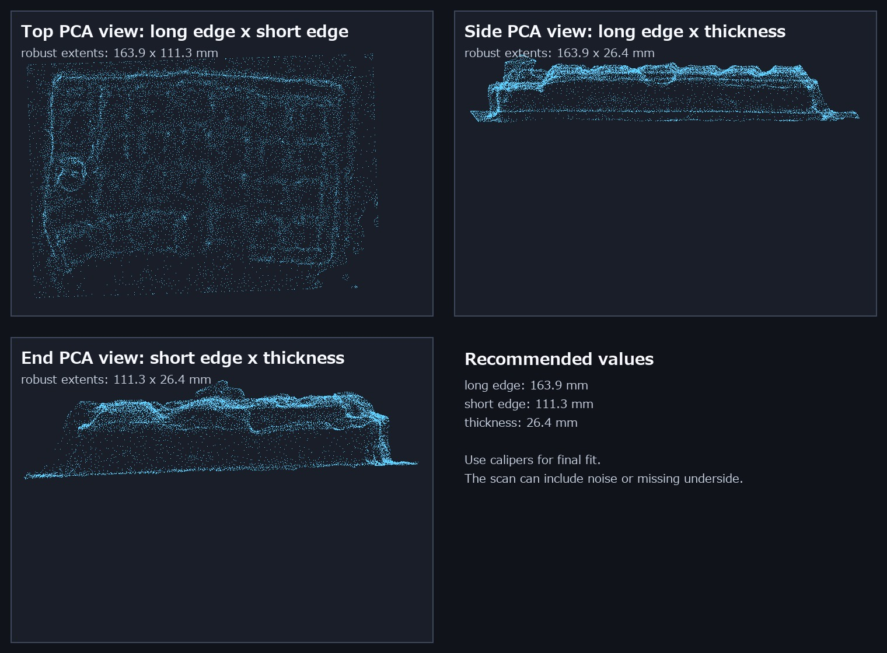
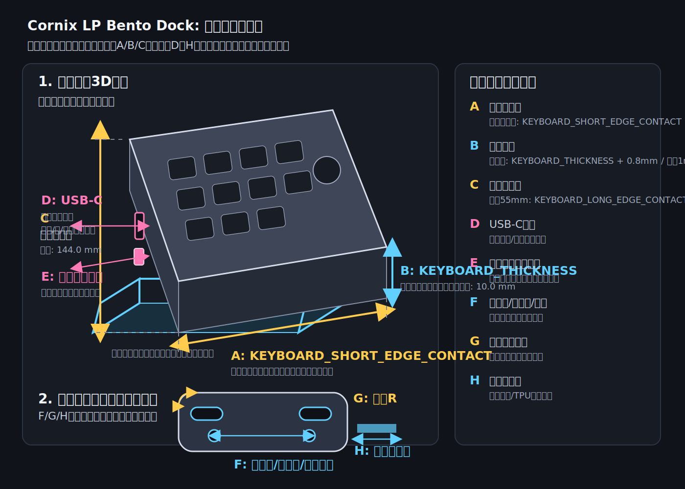
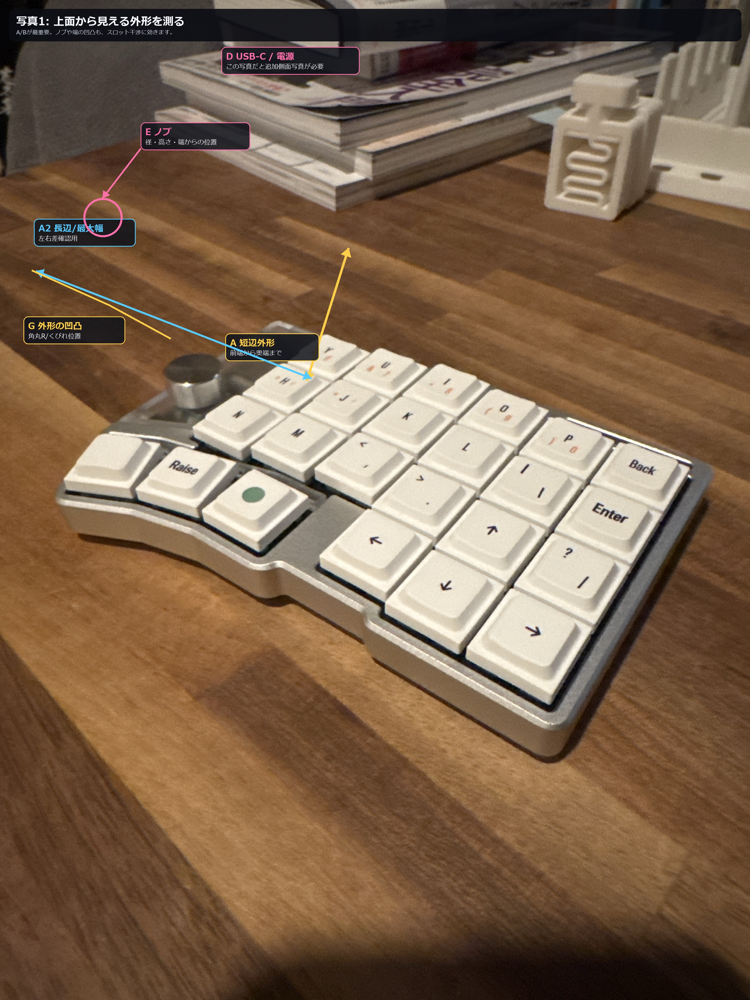
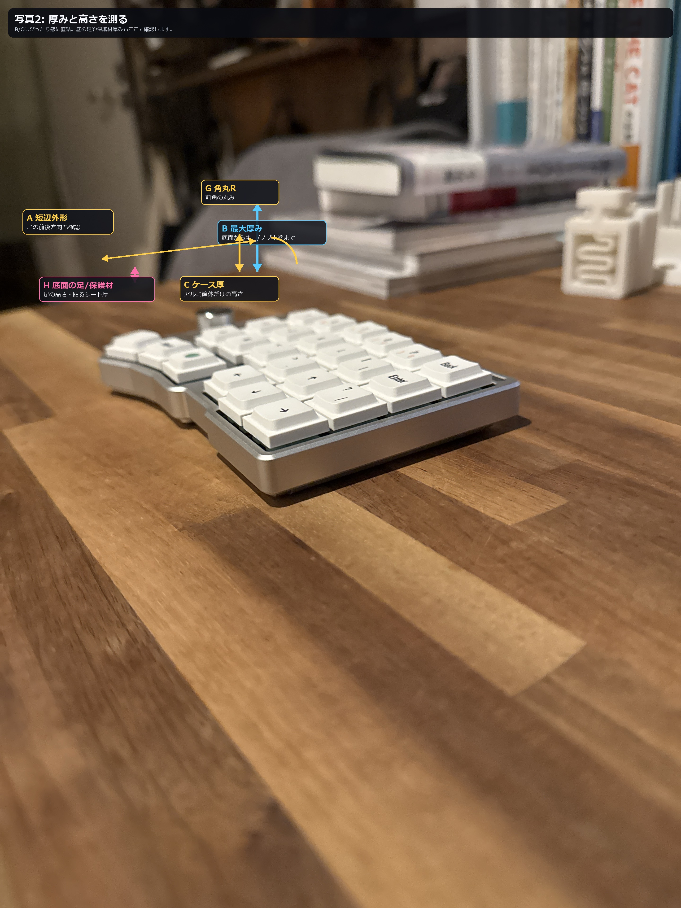

# Cornix LP 短辺下向き Lattice Bento Dock 設計計画

作成日: 2026-06-16

対象: JezailFunder Cornix LP 無線分割キーボードの左右ユニットを、本棚の本のように並べ、短辺を下にして縦置き収納するための 3D プリントスタンド。

## 1. 今回作るもの

左右の Cornix LP を 1 枚ずつ縦に差し込める、2 スロットの卓上収納スタンドを作る。

今回の要件:

- 本棚の本のように左右ユニットを並べる。
- キーボードの短辺を下にして収納する。
- 遊びを少なくし、できるだけぴったり入る寸法にする。
- Scaniverse の 3D スキャン STL を寸法参考にする。
- 材料費を削る。
- 見た目の洗練さ、かっこよさを維持する。
- 格子状のデザインにする。
- Bambu Lab でプリントするため、宙に浮く形状や未接続パーツをなくす。
- キーボード本体を加工しない。

## 2. 参照情報

公式ページで確認した前提:

- Cornix LP は 3x6 配列の分割キーボード。
- 筐体は 6063 アルミ削り出し。
- 6 度、12 度、18 度、24 度の角度調整機構がある。
- USB-C 有線接続と Bluetooth に対応する。

追加で参照した CornixHub アクセサリ情報:

- Cornix Bento Box は、Cornix LP 専用ハードキャリーケースとして `W188 x D120 x T55 mm` と記載されている。
- Cornix Bento Box はキーボード同士を向かい合わせで収納し、デフォルトキーキャップとエンコーダー間のクリアランスは約 1.0 mm と説明されている。
- Cornix LP 用カバー兼リストレストは、ズレにくくするため片側にフック状の部分を追加し、クリアランスをかなり詰めた設計思想になっている。

参照元:

- [CornixHub 非公式アクセサリー](https://cornixhub.com/accessories)
- [Cornix LP 無線分割キーボード - JezailFunder Japan](https://jezailfunder.jp/products/cornix-lp-keyboard)
- [Cornix 日本語マニュアル - JezailFunder Japan](https://docs.channel.io/jezailfunderjp/ja/articles/Cornix-%E6%97%A5%E6%9C%AC%E8%AA%9E%E3%83%9E%E3%83%8B%E3%83%A5%E3%82%A2%E3%83%AB-c1160246)

## 3. Scaniverse STL 解析

取り込んだスキャン:

- `scan/cornix_lp_scaniverse_2026-06-16_221047.stl`

解析スクリプト:

- `tools/analyze_scan_stl.py`

解析結果:



PCA と 0.5-99.5 パーセンタイルの外形から、次の値を設計に採用した。

| 項目 | 推定値 |
| --- | ---: |
| 長辺最大 | 163.9 mm |
| 短辺最大 | 111.3 mm |
| 厚み最大 | 26.4 mm |
| 推奨総クリアランス | 0.8 mm |

注意:

- Scaniverse の STL は実寸に近いが、ノイズ、欠け、机面の一部、見えない裏面の誤差を含む可能性がある。
- 最終印刷前は、ノギスで短辺と厚みだけでも確認する。
- USB-C と電源スイッチは今回の写真とスキャンだけでは完全に位置確定できないため、必要なら側面写真または実測で切り欠きを追加する。

解析JSON:

- `docs/scan-analysis/scaniverse-analysis.json`

## 4. 採寸ガイド

採寸位置は次の図を参照する。



実写真ベースでは次の注釈画像を見る。





最低限ほしい実測値:

| 優先度 | パラメータ | 測るもの | 現在値 |
| --- | --- | --- | ---: |
| 必須 | `KEYBOARD_LONG_EDGE_CONTACT` | 縦置き時に立ち上がる長辺矩形部の長さ | 144.0 mm |
| 参考 | `KEYBOARD_LONG_EDGE_MAX` | 張り出し込みの長辺最大外形。重心と全高の安全確認に使う | 163.9 mm |
| 必須 | `KEYBOARD_SHORT_EDGE_CONTACT` | 収納時に下へ向け、スロット底面へ入る短辺矩形部の長さ | 88.0 mm |
| 参考 | `KEYBOARD_SHORT_EDGE_MAX` | 張り出し込みの短辺最大外形。台座奥行きの安全確認に使う | 111.3 mm |
| 参考 | `KEYBOARD_THICKNESS_MAX_SCAN` | Scaniverse由来の厚み最大。写真実測より大きいため安全確認用に残す | 26.4 mm |
| 必須 | `KEYBOARD_THICKNESS` | 収納時にスロット幅方向へ入る実測厚み | 10.0 mm |
| 必須 | `GROOVE_CAPTURE_HEIGHT` | 底部にはめ込む浅い溝の高さ | 1.0 mm |
| 必須 | `FIT_CLEARANCE` | 片側ではなく総クリアランス。プリンター精度に合わせる | 0.8 mm |

さらに精度を上げるためにほしい値:

- 左右ユニットそれぞれの短辺長さ。
- キーキャップ込み高さ、ノブ込み高さ。
- USB-C ポート位置、幅、高さ、ケーブル挿入時の必要逃げ。
- 電源スイッチ位置、操作に必要な逃げ。
- 底面脚、ゴム足、ネジ、既存テント脚の位置と高さ。
- 外形角丸半径。
- 貼りたい保護材の厚み。

## 5. 再設計方針

Scaniverse 解析と CornixHub のアクセサリ情報から、次の考え方を反映する。

| 参照した要素 | 今回の設計への反映 |
| --- | --- |
| 写真実測の長辺矩形部 `144.0 mm` | 全高 `55.0 mm` を維持。`144.0 / φ² = 55.0 mm` に近く、黄金比の下側支持高さになる |
| 写真実測の短辺矩形部 `88.0 mm` | スロット長を `88.8 mm` に設定 |
| 実測収納厚み `10.0 mm` | 底部はめ込み溝の有効幅を `10.8 mm` に設定 |
| 溝高さ `1.0 mm` | 底面に 1 mm 高の左右リップを作り、下端が軽く噛むようにする |
| 押し込み口の縦方向 | 底部溝を基準に `1.0 mm` 広げる |
| 押し込み口の幅方向 | 底部溝を基準に、中心側へ `4.0 mm`、外側へ `8.0 mm` 広げる |
| スキャン短辺最大 `111.3 mm` | 台座奥行きの安全余裕として残す |
| スキャン厚み最大 `26.4 mm` | 写真実測より大きいため、今回はスロット幅には使わず参考値として残す |
| Cornix Bento Box の `D120 x T55 mm` | 高さは 55 mm に維持。奥行きは張り出し込み最大外形に合わせて 128.3 mm に設定 |
| 約 1.0 mm 級の詰めたクリアランス | 総クリアランスを `0.8 mm` に設定 |
| Bambu Lab でのプリント | 底面 `0.6 mm` の一体スキンと溝下土台を追加し、格子・溝・ストッパーが台座へ連続するようにする |
| ズレ止め | 内側へ張り出すフックはなくし、底部 1 mm 溝と前後ストッパーで位置決めする |
| 材料費削減 | 外周側は片側 2 本の斜め支柱へ集約し、中央ディバイダー上部は 2 枚フィンにする |

## 6. 格子状デザイン

材料費と見た目のため、面で支えるブレードを最小限のエアフレームへ変更した。

格子化した箇所:

- 台座: `0.6 mm` の薄い一体底スキンの上に、外周フレーム、黄金比位置のクロスバー、斜めクロスバー、溝下土台を載せる。
- 左右外周: 連続した壁やレールは作らず、片側 2 本の斜め支柱だけで保持する。
- 中央ディバイダー: 下側は連続レール、上側は先端を丸めた 2 枚フィンを置く。
- 補強: 大外側の短い補強支柱は削除し、保持は外周の片側 2 本支柱と中央 2 枚フィンへ集約する。

全部を格子にすると、材料は減るがぴったり感が落ちる。今回は「底面で一体性、下側で精度、上側で軽量化と見た目」という分担にした。底面スキンは薄く抑え、Apple 製品のような一体感のある影を作りつつ、上側の細い垂直ポストと大外側の短い補強支柱は削除する。外周側の保持レールは全長の壁ではなく、左右それぞれ `1/φ²` と `1/φ` の位置に 2 本の独立した斜め支柱だけを置く。各支柱は中央フィンと同じ `4.5 mm` 幅で、壁状につながらないようにする。内側は垂直に保持し、外側は斜めへ落ちる。中央保持部は同じ黄金比位置に 2 枚フィンを置き、側面はまっすぐ、先端だけ `3.0 mm` の肩落ちで丸めた三角形状にする。外周フレームと中央側には `1.2 mm` の多角形Rを入れる。

## 7. 現在の寸法

生成済み STL の仕様:

| 項目 | 値 |
| --- | ---: |
| ベース幅 | 74.2 mm |
| ベース奥行き | 128.3 mm |
| ベース厚み | 5.0 mm |
| 一体底スキン | 0.6 mm |
| 全体高さ | 55.0 mm |
| スロット数 | 2 |
| 想定キーボード長辺最大 | 163.9 mm |
| 実測長辺矩形部 | 144.0 mm |
| 想定キーボード短辺最大 | 111.3 mm |
| 実測短辺矩形部 | 88.0 mm |
| Scaniverse厚み最大 | 26.4 mm |
| 実測収納厚み | 10.0 mm |
| 総クリアランス | 0.8 mm |
| 押し込み口内寸 長さ | 89.8 mm |
| 押し込み口内寸 幅 | 22.8 mm |
| 押し込み口 縦方向広げ量 | 1.0 mm |
| 押し込み口 中心側広げ量 | 4.0 mm |
| 押し込み口 外側広げ量 | 8.0 mm |
| 底部はめ込み溝 有効幅 | 10.8 mm |
| 底部はめ込み溝 有効長 | 88.8 mm |
| 底部はめ込み溝 高さ | 1.0 mm |
| 下側連続保持レール | 12.0 mm |
| 外周側保持レール | 片側 2 本の斜め支柱 |
| 外周側支柱幅 | 4.5 mm |
| 中央フィン厚み | 4.5 mm |
| 細部R | 1.2 mm |
| 先端フラット幅 | 1.6 mm |
| 先端肩落ち | 3.0 mm |
| 側壁高さ | 50.0 mm |
| 前後ストッパー高さ | 10.0 mm |
| フックかかり量 | 0.0 mm |
| STL 三角形数 | 1104 |

台座は `128.3 / 74.2 = 1.73` で、厳密な黄金比より少し奥行きを優先している。これはスキャン短辺最大 `111.3 mm` と前後ストッパーを安全に収めるため。全体高さは `144.0 / φ² = 55.0 mm` に近く、縦置きした長辺矩形部に対して黄金比の下側支持高さになる。底部溝は、写真実測の短辺矩形部 `88.0 mm` と厚み `10.0 mm` を基準に `88.8 x 10.8 x 1.0 mm` とした。押し込み口は底部溝に対して縦方向へ `1.0 mm`、中心側へ `4.0 mm`、外側へ `8.0 mm` 広げ、導入口を `89.8 x 22.8 mm` にした。

Bambu Lab 向けに、底部溝の真下と前後ストッパーの真下には台座厚みまで続く土台を入れている。格子の穴は残すが、印刷途中に空中から始まる島や、完成後に独立する小パーツは作らない方針。上部横材と細い垂直ポストを削り、外周は 2 本支柱、中央は 2 枚フィンにしたため、Bambu Studio のツリーサポートが内部に入り込みにくい。

## 8. 出力ファイル

生成済み STL:

- `stl/cornix_lp_bookshelf_storage_stand.stl`
- `stl/cornix_lp_fit_check_coupon.stl`

生成スクリプト:

- `cad/generate_bookshelf_storage_stand.py`
- `cad/generate_fit_check_coupon.py`

再生成コマンド:

```powershell
python cad/generate_bookshelf_storage_stand.py
python cad/generate_fit_check_coupon.py
```

この環境では PATH 上に `python` がないため、Codex 同梱 Python で生成した。

サイズ確認用テストピース:

| 項目 | 値 |
| --- | ---: |
| 外形 | 27.6 x 95.8 x 8.0 mm |
| スロット数 | 1 |
| 押し込み口 | 89.8 x 22.8 mm |
| 底部はめ込み溝 | 88.8 x 10.8 x 1.0 mm |
| 中心側広げ量 | 4.0 mm |
| 外側広げ量 | 8.0 mm |
| STL 三角形数 | 96 |

このテストピースは、はめ込み寸法を変えずに材料量を抑えるため、本番の高さ・2スロット構成・格子壁を省いた確認用モデル。短辺方向の長さ、厚み方向、1 mm 溝の噛み具合だけを先に見る。

## 9. 印刷設定案

推奨:

- 材料: PETG、PETG-CF、PETG-GF、または PLA+
- レイヤー高: 0.20 mm
- ノズル: 0.4 mm
- 壁数: 3 から 4
- インフィル: 15% から 25%
- 上下面: 4 層以上
- サポート: 不要想定
- ブリム: 反りが出る場合のみ使用

見た目重視ならマット系フィラメントが合う。材料費をさらに抑えるなら、壁数 3、インフィル 10% から試す。ただし前後ストッパー、底部溝、下側レールの強度を落としすぎないこと。

ぴったり入れる前提なので、初回は積層誤差を見るために 10 mm 高さ程度で途中停止または部分試作して、スロット幅を確認すると安全。

現時点では、途中停止より `stl/cornix_lp_fit_check_coupon.stl` を先に印刷する方が材料を抑えやすい。

Bambu Studio では底面をプレートに置く向きで読み込み、レイヤープレビューで底部溝とストッパーが台座から連続して積まれていることを確認する。

## 10. 実機確認ポイント

印刷前に確認すること:

- 短辺がスロット底面に入る向きになっているか。
- 底部はめ込み溝 `88.8 x 10.8 x 1.0 mm` が実機に対して適切か。
- 押し込み口内寸 `89.8 x 22.8 mm` で差し込みやすいか。
- USB-C ポートや電源スイッチが側壁支柱や中央フィンに当たらないか。
- キーキャップやノブを強く押し付ける向きになっていないか。
- 2 枚を入れたとき、中央ディバイダーに干渉しないか。
- 前後ストッパーで取り出しが重くなりすぎないか。
- 中央フィンがたわまないか。

実機で合わない場合の調整:

- 短辺方向がきつい: `KEYBOARD_SHORT_EDGE_CONTACT` を実測値にするか、`FIT_CLEARANCE` を増やす。
- 厚み方向がきつい: `KEYBOARD_THICKNESS` を実測値にするか、`FIT_CLEARANCE` を増やす。
- 倒れやすい: `SIDE_WALL_HEIGHT` を増やす。
- 取り出しにくい: `SIDE_WALL_HEIGHT` または `END_STOP_HEIGHT` を下げる。
- もっと軽くしたい: `CENTER_TRIANGLE_RIB_THICKNESS` や `OUTER_GUARD_PILLAR_WIDTH` を薄くする。
- もっと強くしたい: `CENTER_TRIANGLE_RIB_THICKNESS` や `OUTER_GUARD_PILLAR_WIDTH` を厚くする。
